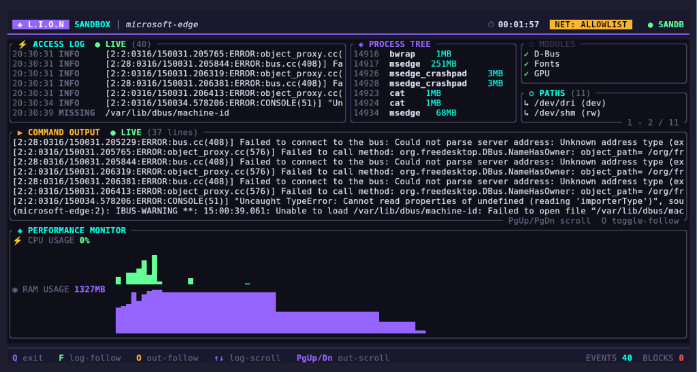

#  L.I.O.N

> **L**imit, **I**solate, **O**bserve, **N**amespace.
> Hardened, real-time sandboxing for untrusted commands.

**Hackathena'26 Second Runner Up Prize Winner**

L.I.O.N is a security-first sandbox engine for Linux built on top of `bubblewrap` (`bwrap`). It lets you run CLI tools, package managers, scripts, and many GUI binaries inside a disposable namespace cage with explicit exposure control.

What makes L.I.O.N unique is **Observability**: it doesn't just block access; it shows you exactly what the program is trying to do in real-time.

In one line: **limit what code can access, isolate execution, and observe behavior live**.

---

---

## Technical Overview

L.I.O.N provides a robust layer of isolation for your daily development tasks. By leveraging Linux namespaces and bind mounts, it ensures that untrusted code remains confined to a strictly defined environment.

### Key Capabilities

- **Disposable Per-Run Sandbox**: Every session starts from a fresh synthetic root and is destroyed immediately upon exit.
- **Environment Scrubbing**: Automatically wipes sensitive environment variables like AWS keys and GitHub tokens.
- **Live Observability**: Real-time tracking of file access (Read, Write, Delete) and blocked permission attempts.
- **Performance Monitoring**: Integrated CPU and RAM telemetry for the sandboxed process tree.
- **Network Control**: Flexible network modes including None, Allow (domain-filtered), or Full.
- **Source Protection**: Automatically re-mounts project source directories as read-only to prevent tampering.

---



---

## Why L.I.O.N?

Most security tools focus either on blocking or on logging. L.I.O.N combines both into a single, low-friction workflow designed specifically for developers.

- **Lower Friction**: No need to manage complex container lifecycles or VM images for single commands.
- **High Visibility**: Integrated TUI provides immediate feedback on what your tools are doing.
- **Granular Control**: Define exactly what files and network domains your commands can access.

## Quick Start

### Installation

Ensure `bubblewrap` is installed on your system:

```bash
# Ubuntu/Debian
sudo apt install bubblewrap

# Fedora
sudo dnf install bubblewrap

# Arch
sudo pacman -S bubblewrap
```

Install via Cargo:

```bash
git clone https://github.com/A56-A5/lion.git
cd lion
cargo install --path .
```

### Basic Usage

Run a command in a fully isolated sandbox:

```bash
lion run -- npm install
```

Start with the TUI dashboard for live monitoring:

```bash
lion run --tui -- npm run dev
```

---

## Documentation

- [How to Use](HowToUse.md) - Complete usage guide and configuration details.
- [Exposure Report](Exposure.md) - Detailed security analysis and honest tool rating.

## License

MIT
