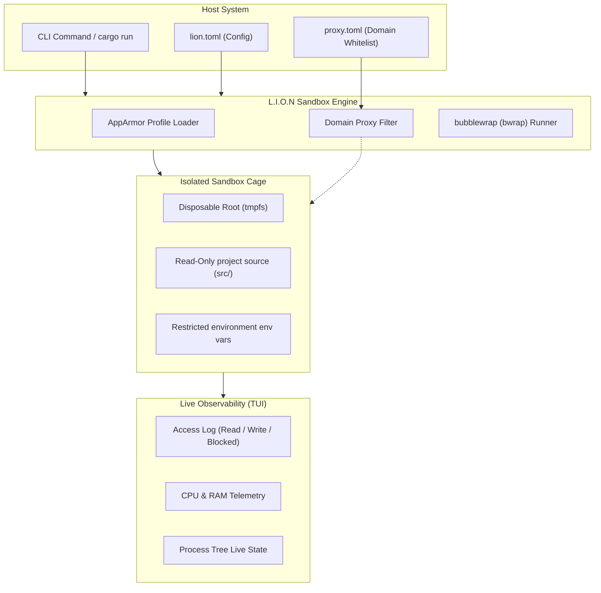

#  L.I.O.N

> **L**imit, **I**solate, **O**bserve, **N**amespace.
> *Hardened, real-time sandboxing for untrusted commands.*

[](https://opensource.org/licenses/MIT)
[](https://www.rust-lang.org)
[](https://github.com/containers/bubblewrap)
[](https://github.com/ratatui-org/ratatui)

**🏆 Hackathena'26 National Level Hackathon — Second Runner-Up Prize Winner**


L.I.O.N is a security-focused sandbox engine for Linux built on top of `bubblewrap` (`bwrap`). It allows you to execute CLI commands, compile scripts, and run package managers or even GUI applications inside a disposable namespace cage with strict exposure control. 

What makes L.I.O.N unique is **Observability**: it does not just block unauthorized access; it displays exactly what the sandboxed process is attempting to do in real time.

---

## 📸 Interactive TUI Dashboard


---

## ⚙️ Architecture & Dataflow

L.I.O.N utilizes Linux namespaces (User, PID, Network, IPC, UTS, Cgroup) to isolate processes. Every run starts inside a fresh, RAM-backed synthetic root, leaving your home directory entirely private except for explicit mounts.



---

## 🛡️ Motivation: Preventing Supply Chain Attacks

In modern software development, executing commands like `npm install`, `pip install`, or running compilation scripts (such as `build.rs` in Rust) triggers dozens of nested third-party scripts. 

> [!WARNING]
> **The Threat: Supply Chain Compromise**
> Malicious dependencies can easily execute arbitrary code on your system during their install/compilation lifecycle. By default, they run with the same permissions as your user, giving them access to your private documents, `.ssh/` keys, session credentials, and environment secrets. They can easily transmit these credentials over the network to external command-and-control servers.

L.I.O.N protects developers from this exact threat by acting as an automatic, configurable shield:
1. **Confining Installers**: Package managers and installers run confined inside a synthetic root where they cannot see private host files, dotfiles, or system secrets.
2. **Preventing Code Injection**: Even if a project directory is writable, L.I.O.N overlays the critical `src/` directory containing your source code as **read-only**, meaning a malicious postinstall script cannot silently rewrite your code or inject backdoors.
3. **Observing Live Threats**: Through real-time TUI dashboard logging, you immediately see if a dependency attempts to access unexpected directories or network resources.

---

## 🚀 Key Capabilities


*   🔒 **Disposable Sandbox**: Every session initializes from an empty `tmpfs` structure and is completely wiped immediately upon exit.
*   🧹 **Credential & Secret Protection**: Automatically scrubs critical environment variables (such as AWS keys, GitHub tokens, and cargo/npm credentials) to prevent credential leakage.
*   📊 **Real-Time Observability**: Built-in interactive dashboard traces filesystem actions (Read, Write, Blocked) and tracks resource utilization.
*   🛡️ **Source Shielding**: Even when granting write access to project folders, the source directory (`src/`) is overlaid as read-only to prevent malicious scripts from rewriting your code.
*   🌐 **Network Restrictions**: Choose between no network (`none`), domain-whitelisted access (`allow`), or unrestricted network (`full`).
*   🖥️ **GUI Compatibility**: Seamlessly forwards graphic servers (X11/Wayland), audio, GPU sockets, and fonts for testing GUI tools.

---

## 🛠️ Getting Started

### 1. Install Prerequisites

L.I.O.N requires the **Rust toolchain** (to build the code) and **bubblewrap** (the low-level sandboxing engine).

#### Install Rust & Cargo
If you don't have Rust installed, set it up via `rustup`:
```bash
curl --proto '=https' --tlsv1.2 -sSf https://sh.rustup.rs | sh
```
Follow the on-screen instructions, then restart your shell or run:
```bash
source "$HOME/.cargo/env"
```

#### Install Bubblewrap (`bwrap`)
Ensure `bubblewrap` is installed via your package manager:
```bash
# Ubuntu / Debian
sudo apt install bubblewrap

# Fedora
sudo dnf install bubblewrap

# Arch Linux
sudo pacman -S bubblewrap
```


### 2. Choose Your Usage Method

L.I.O.N can be run either locally during development or installed globally on your machine.

#### Method A: Run Locally via Cargo (No Installation)

If you are developing or testing changes locally, clone the repository and run L.I.O.N using Cargo:

```bash
# Clone the repository
git clone https://github.com/A56-A5/lion.git
cd lion

# Run cargo check to verify dependencies
cargo check

# Run a sandboxed command directly
cargo run -- run -- <command> <args>

# Examples:
cargo run -- run -- ls -la
cargo run -- run --tui --net=full -- npm run dev
```

#### Method B: Install Globally

To use the `lion` CLI tool system-wide from any directory:

```bash
# Navigate to the cloned folder and install globally
cargo install --path .

# Run a sandboxed command from anywhere
lion run -- <command> <args>

# Example:
lion run --tui --net=allow -- npm install
```

### 3. One-Time AppArmor Setup (For Ubuntu 24.04+)

Modern Linux distributions restrict unprivileged user namespaces by default. L.I.O.N includes a setup utility to load a targeted AppArmor profile permitting `bwrap` namespace creation:

**If running locally:**
```bash
cargo build
sudo ./target/debug/lion install
```

**If installed globally:**
```bash
sudo $(which lion) install
```

---

## 🖥️ Interactive Dashboard Keyboard Shortcuts

When running with the `--tui` flag, the following keyboard keys control the dashboard:

| Key | Action |
| :--- | :--- |
| `Q` | Kill the sandbox and quit immediately |
| `F` | Toggle auto-follow for the Access Log panel |
| `O` | Toggle auto-follow for the Command Output panel |
| `Page Up` / `Page Down` | Scroll through the Command Output log |
| `Up` / `Down` arrow keys | Scroll through the Access Log entries |

---

## 📄 Documentation

For full details, configs, and analysis reports, please refer to:
*   📖 **[How to Use L.I.O.N](HowToUse.md)** — Detailed command reference, configuration parameters (`lion.toml`, `proxy.toml`), and practical developer workflows.
*   🛡️ **[Security Exposure Report](Exposure.md)** — In-depth analysis of sandbox limits, security posture, and honest threat assessment.

---

## 📝 License

Distributed under the MIT License. See [LICENSE](LICENSE) or the repository root for details.
